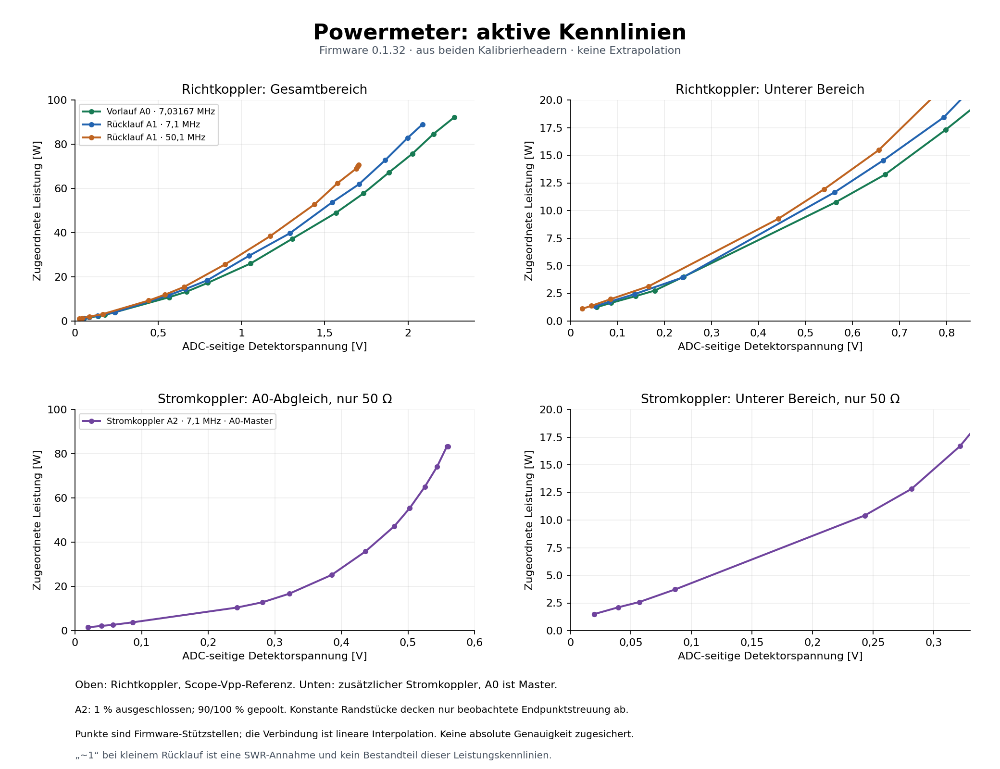

# pico-zephyr-ham-lab-powermeter

HF-Leistungs- und SWR-Anzeige mit **Raspberry Pi Pico W / RP2040**, Zephyr, ADS1115, OLED und Weboberfläche. Ein Richtkoppler erfasst Vorlauf/Rücklauf/SWR. A2 nimmt einen zusätzlichen Messkopf auf: beispielsweise einen auf A0 abgeglichenen Stromkoppler, einen OA79-HF-Detektor oder eine direkte Gleichspannung.

**Stand: Firmware 0.1.49, 9. Oktober 2026.** Build und Betrieb wurden auf Ulrichs Pico W getestet. WLAN und Access Point, Web-Datenabruf sowie wiederholtes Umschalten wurden mit Ubuntu bzw. MacBook getestet; die iPhone-Anmeldung ist noch nicht erfolgreich bestätigt. Der AP benötigt die dokumentierte externe WHD-Korrektur. [Netzwerk und AP](docs/netzwerk-ap.md).

Kennlinien sind empirisch erfasst und aufbauabhängig; eine absolute Messgenauigkeit ist nicht nachgewiesen. Detektoren des Richtkopplers: **1N4148**. A2 unterstützt austauschbare Messköpfe mit eigenen Profilen, einschließlich OA79 bei 1 MHz. [Kennlinienprofile](docs/kennlinien-profile.md). USB-Massenspeicher ist noch nicht implementiert; JSON-Import erfolgt über USB-Shell oder Telnet.

Eigenständige Migration von [swr_power_meter_pico_micropython](https://github.com/ukagit/swr_power_meter_pico_micropython), auf Basis von [pico-zephyr-hamlab 0.3.7](https://github.com/ukagit/pico-zephyr-hamlab). Das bestehende HamLab-Projekt bleibt unverändert.

## Funktionen

- Vorlauf A0−A3, Rücklauf A1−A3 und zusätzlicher Messkopf A2−A3 mit eigener ADS1115-Autorange je Kanal.
- Watt aus gemessenen Kennlinien, lineare Interpolation zwischen Stützstellen.
- SWR aus getrennten Vor-/Rücklaufleistungen, wenn Messbereich und Kurvenkombination geeignet sind.
- **A0 ist Master:** Die zusätzliche A2-Wattanzeige ist bei 7,1 MHz an 50 Ω auf A0 abgeglichen.
- Web-Vollansicht und Kompaktseite, Leistungsbalken mit Autoscale 10/20/50/100/150 W und Max-Hold für Leistung/SWR.
- SWR-Farbbalken: grün/gelb/rot; weißer Messwert, gelber Hold, blaues **~1** als Annahme unter der Rücklauf-Messgrenze.
- Fünf OLED-Ansichten: A0 kompakt, Details, Akku, A2-Leistung mit dBm und A2-Voltmeter.
- Umschaltung über Encoder und Taster GP19/20/21.
- Akkuspannung über GP28/ADC2 und 1:2-Spannungsteiler.
- Gespeichertes WLAN oder Access Point per Taste 3 beim Start, USB-/Telnet-Shell und JSON-API.
- Letzte gültige Vorlaufmessung mit NTP-Zeitstempel und zugehörigem gültigem SWR.
- PC-Werkzeuge für ICOM-CW-Sweeps, Scope-Messreihen, Tastkopfvergleich und automatischen A2-Abgleich.

DDS, Dämpfer und Generator-Sweep sind nicht mehr Teil der aktiven Powermeter-Firmware.

## Anschlüsse

| Funktion | Anschluss |
|---|---|
| Board | Pico W / RP2040, `rpi_pico/rp2040/w` |
| GPIO-I²C | GP0 SDA / GP1 SCL |
| ADS1115 / SSD1306 128×64 | `0x48` / `0x3c` |
| Richtkoppler Vorlauf / Rücklauf | A0−A3 / A1−A3 |
| Zusätzlicher Messkopf / Voltmeter (1:1) | A2−A3 |
| Gemeinsame ADC-Referenz | A3 an Masse |
| Akku | GP28 / Pico ADC2, 10 kΩ oben + 10 kΩ unten, Faktor 2 |
| Encoder | GP15 CLK / GP14 DT / GP13 Taster |
| Taster Kompakt / Voll / Akku | GP19 / GP20 / GP21 gegen Masse |

Die ADC-Spannungsgrenzen gelten unabhängig vom gewählten PGA-Bereich. Akku niemals direkt an GP28 anschließen. Details: [Bedienung und Hardware](docs/bedienung.md).

## Kennlinien und Grenzen

| Messgröße | Frequenz | ADC-Spannung | Hinterlegte Leistung |
|---|---:|---:|---:|
| Vorlauf A0 | 7,03167 MHz | 0,055664–2,277875 V | 1,2544–92,16 W |
| Rücklauf A1 | 7,1 MHz | 0,053018–2,087208 V | 1,3456–88,99 W |
| Rücklauf A1 | 50,1 MHz | 0,024987–1,705125 V | 1,1096–70,56 W |
| Stromkoppler A2, auf A0 abgeglichen | 7,1 MHz, ohmsche 50 Ω | 0,019688–0,560063 V | 1,4943–83,3462 W |

Optionales Profil OA79 bei 1 MHz: A2 0,0023984–2,883 V entspricht etwa 11,02 µW–90 mW. Importdatei: [oa79_50ohm_1mhz.json](docs/calibration/oa79_50ohm_1mhz.json). Das Profil ersetzt nur die A2-Zuordnung; die Standardkurve bleibt verfügbar.

A2 verwendet im Standardprofil die aus dem Abgleich gemessenen Randspannungen; obere 90/100-%-Punkte sind zusammengefasst. [Auswertung und vollständige Grenzen](docs/abgleich-ergebnis-v0.1.32.md).

**150 W ist eine Balkenskala, keine Kalibrierung bis 150 W.** Außerhalb der Kennlinien wird keine Wattzahl extrapoliert. Sendefrequenz wird nicht automatisch erkannt; die Vorlaufkurve ist noch nicht frequenzabhängig. Für die 50,1-MHz-Rücklaufkurve fehlt eine passende Vorlaufkurve: keine freigegebene numerische SWR-Auswertung.

**~1 ist eine Anzeigeannahme**, kein gemessener SWR-Wert und keine bestätigte Obergrenze von 1,5. A2 misst lokalen Strom; seine auf 50 Ω bezogene Wattzahl ist bei Fehlanpassung keine allgemeine Wirkleistungs- oder Vorlaufmessung. A2 wird nicht für SWR verwendet.



## Schnellstart

Umgebung: Zephyr **4.4.99**, west **1.5.0**, SDK **1.0.1**, Snippet `cdc-acm-console`. Tatsächlich verwendet wird **Pico W**, nicht Pico 2 W.

Flaches, unkomprimiertes TAR im bestehenden Powermeter-Verzeichnis mit `tar -xf DATEI.tar` entpacken:

```bash
cd /home/ulrich/Dokumente/zephyrproject/apps/pico-zephyr-ham-lab-powermeter
west blobs fetch hal_infineon
python3 tools/fix_whd_ap_channel.py /home/ulrich/Dokumente/zephyrproject/modules/hal/infineon/whd-expansion/WHD/COMPONENT_WIFI5/src/include/whd_chip_constants.h
west build -b rpi_pico/rp2040/w -S cdc-acm-console . -d build -p always
./tools/flash_openocd.sh
```

Alternativ UF2 `build/zephyr/zephyr.uf2` per BOOTSEL kopieren. Für USB richtigen Zephyr-CDC-Port unter `/dev/serial/by-id/` wählen, nicht den Debug-Probe-Port.

```text
hamlab info
hamlab meter
hamlab power
hamlab swr
network_status
```

WLAN-Zugangsdaten mit `wifi cred add -h` gemäß der lokalen Zephyr-Hilfe speichern, anschließend `wifi_stored`. Zugangsdaten liegen in Settings/NVS auf dem Pico, nicht im Repository.

Laboradresse: [Vollansicht](http://192.168.178.98:8080/) · [Kompakt](http://192.168.178.98:8080/compact).

```bash
telnet 192.168.178.98 23
curl http://192.168.178.98:8080/api/v1/state
```

DHCP-Adresse bei Bedarf anpassen. USB und Telnet benötigen keinen Benutzer-/Passwort-Login. HTTP/Telnet sind für das vertrauenswürdige lokale Netz vorgesehen.

Taste 3 (GP21 gegen Masse) beim Einschalten gedrückt halten: offener AP **HamLab-DL2DBG**, kein Passwort, Webseite **http://192.168.4.1:8080/**. Ohne Tastendruck startet das gespeicherte WLAN. Der Modus wird nicht gespeichert. [Bedienung und Fehlerdiagnose](docs/netzwerk-ap.md).

## Dokumentation

- [WLAN, Access Point und WHD-Korrektur](docs/netzwerk-ap.md)
- [Bedienung, Hardware, Web, OLED und API](docs/bedienung.md)
- [Messaufbau, Kalibrierung und Erkenntnisse](docs/messung-und-kalibrierung.md)
- [PC-Test- und Kalibrierwerkzeuge](docs/testwerkzeuge.md)
- [Automatisierter Abgleich A2 auf A0](docs/abgleich-a2-auf-a0.md)
- [Abgleich-Ergebnis und obere Plateau-Behandlung](docs/abgleich-ergebnis-v0.1.32.md)
- [Historischer Tastkopfvergleich des Stromkopplers an A0](docs/tastkopfvergleich-neuer-koppler.md)
- [Kennlinien als PDF](docs/images/powermeter-kennlinien-v0.1.32.pdf)
- [Standardstützstellen als CSV](docs/calibration/firmware-v0.1.32-kennlinien.csv)
- [GitHub-Veröffentlichung](docs/github-veroeffentlichung.md)
- [Änderungen](CHANGELOG.md)

Ältere Versionsberichte dokumentieren den Entwicklungsweg. Für den aktuellen Betrieb gelten README und Bedienungsanleitung; ältere Verdrahtungen und Messgrenzen nicht übernehmen.

## Projektstruktur

| Pfad | Inhalt |
|---|---|
| `src/main.c` | Messung, Verarbeitung, OLED, Taster, Shell, HTTP |
| `src/power_calibration.h` | Vorlauf-/Rücklaufkennlinien und SWR |
| `src/current_calibration.h` | Eigene A2-Kennlinie mit A0 als Master |
| `src/network/` | WLAN, Telnet und NTP |
| `web/` | HTML für Voll-/Kompaktansicht |
| `src/hamlab_web.h` | Aus HTML generierte Einbettung |
| `boards/`, `prj.conf`, `CMakeLists.txt` | Zephyr-Konfiguration, GP28-ADC |
| `tools/` | Flash, ICOM, Messreihen, Abgleich und Grafik |
| `docs/calibration/` | Ausgewählte Messdaten und aktive Stützstellen |

Nach HTML-Änderungen: `python3 tools/embed_web.py`. Build und virtuelle Umgebung nicht einchecken. `.gitignore` erlaubt ausgewählte CSVs unter `docs/calibration/`.
